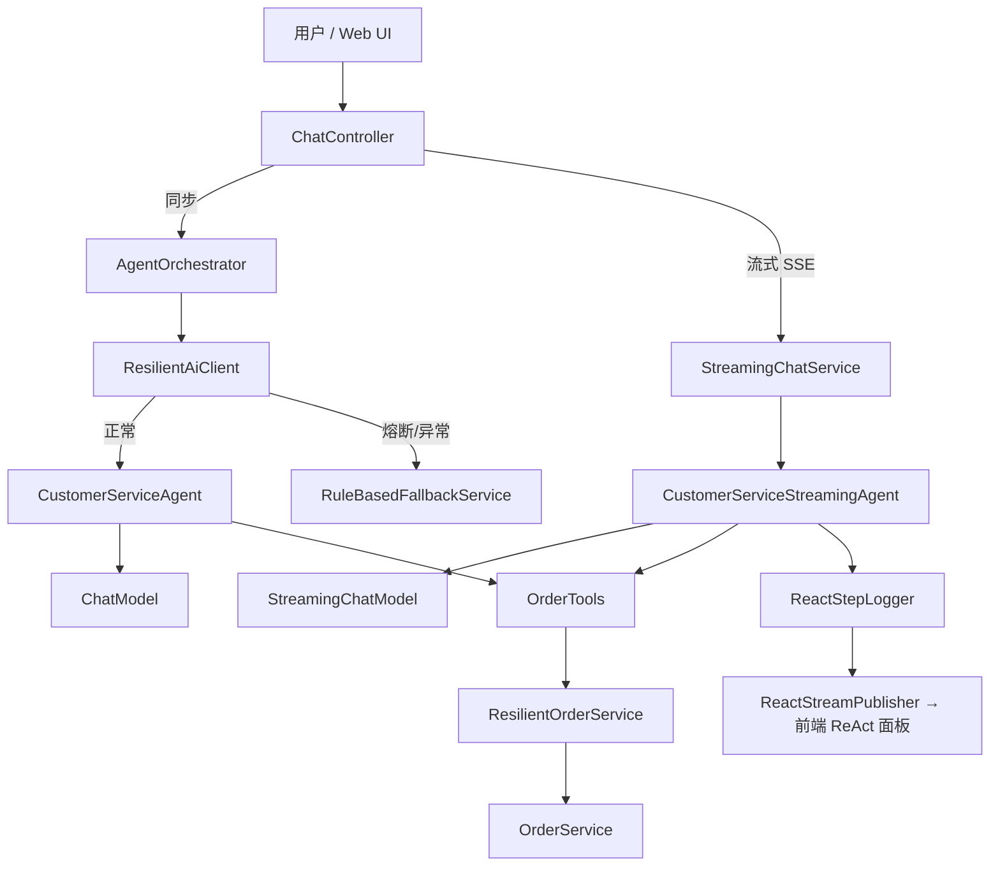

# AI Platform · 智能客服

> 仓库：[github.com/MMCISAGOODMAN/customer-service-agent](https://github.com/MMCISAGOODMAN/customer-service-agent)

基于 **Spring Boot 3** + **LangChain4j** + **Docker** 的**模块化 AI 平台**。  
当前落地第一个业务应用：**电商智能客服（智服云）**。  
核心特性：**ReAct 推理**、**SSE 流式对话**、**多层容错**、**可观测 ReAct 过程**。

---

## 目录

- [项目简介](#项目简介)
- [模块架构](#模块架构)
- [业务分层](#业务分层)
- [架构设计](#架构设计)
- [容错机制](#容错机制)
- [项目结构](#项目结构)
- [快速开始](#快速开始)
- [Web 界面](#web-界面)
- [API 文档](#api-文档)
- [配置说明](#配置说明)
- [扩展指南](#扩展指南)
- [测试指南](#测试指南)
- [技术栈](#技术栈)

---

## 项目简介

平台采用**多模块 Maven** 结构，将 AI 通用能力与业务应用解耦，便于后续扩展 RAG、工作流、多模态等能力。

当前客服应用模拟「智服云」电商场景：用户通过自然语言查询订单、咨询退换货。系统使用 LangChain4j 构建 **ReAct Agent**，自主规划步骤、调用工具、根据 Observation 调整策略。

当 AI 不可用时，自动降级到**规则引擎**，仍可完成订单查询和 FAQ 回答。

### 核心能力一览

| 能力 | 实现方式 | 说明 |
|------|----------|------|
| ReAct 推理 | LangChain4j AI Services + Tools | Thought → Action → Observation 循环 |
| 流式对话 | SSE `/api/v1/chat/stream` | 逐字输出 + ReAct 步骤实时展示 |
| Web 客服 UI | `static/` 单页应用 | 流式聊天、ReAct 过程面板 |
| AI 参数修正 | `param-correction-mode: ai` | 格式错误反馈给 LLM 重试（可见 ReAct） |
| 基础设施修正 | `param-correction-mode: infrastructure` | 代码静默修正（生产容错） |
| 订单服务重试 | Spring Retry | 瞬时故障指数退避 |
| 熔断降级 | Resilience4j + 规则引擎 | AI 连续失败时降级 |

---

## 模块架构

```
ai-platform/                          # 父工程 (com.example.ai)
├── ai-common/                        # 公共类型、异常
├── ai-observability/                 # ReAct 追踪、日志、SSE 桥接
├── ai-llm/                           # LLM 提供商路由 (OpenAI / Ollama)
├── ai-agent/                         # Agent 内存、ReAct 构建器
├── ai-rag/                           # 【预留】RAG / 向量检索
├── ai-workflow/                      # 【预留】多 Agent 工作流
├── ai-multimodal/                    # 【预留】多模态 (视觉 / 语音)
└── customer-service-app/             # 客服业务应用（可运行）
```

### 模块依赖关系

```
customer-service-app
    └── ai-agent
            ├── ai-llm
            ├── ai-observability
            │       └── ai-common
            └── ai-common
```

| 模块 | 职责 | 后期扩展 |
|------|------|----------|
| `ai-common` | 共享异常、工具类 | 全平台通用 DTO |
| `ai-observability` | `ReactStepLogger`、`ReactStreamPublisher` | 链路追踪、指标 |
| `ai-llm` | `LlmConfig`、`StreamingLlmConfig` | 多模型路由、负载均衡 |
| `ai-agent` | `AgentMemoryConfig`、`ReactAgentConfigurer` | 多 Agent 类型 |
| `ai-rag` | 预留 | Embedding、向量库、文档解析 |
| `ai-workflow` | 预留 | DAG 编排、Agent 协作 |
| `ai-multimodal` | 预留 | 图像、语音模型 |
| `customer-service-app` | 客服业务 | 可新增其他 `*-app` 模块 |

---

## 业务分层

`customer-service-app` 内采用经典分层，便于业务扩展：

```
com.example.ai.customerservice
├── api/                    # 接口层：Controller、DTO
├── application/              # 应用层：Agent 接口、编排服务、Spring 配置
├── domain/                 # 领域层：模型、业务异常
└── infrastructure/         # 基础设施：订单仓储、工具、降级、Web 异常处理
```

---

## 架构设计

### 请求处理流程



### ReAct 循环

```
用户: "查订单 ord10001"
    │
    ▼
Thought  → LLM 分析意图，决定调用 queryOrderById
    │
    ▼
Action   → OrderTools.queryOrderById("ord10001")
    │
    ▼
Observation → 格式错误 / 订单数据（反馈给 LLM）
    │
    ▼
Thought  → 修正参数或换策略，再次 Action
    │
    ▼
最终回复（流式逐字输出）
```

配置项 `app.agent.max-sequential-tool-invocations` 限制最大工具调用轮次（默认 10）。

### 三层容错

```
┌─────────────────────────────────────────────────────────┐
│  Layer 1: ReAct 循环（AI 智能重试）                      │
│  工具失败 → Observation 文本 → LLM 修正后重试            │
├─────────────────────────────────────────────────────────┤
│  Layer 2: 基础设施重试                                   │
│  · 订单服务 Spring Retry（瞬时故障，最多 3 次）            │
│  · LLM HTTP max-retries（网络抖动）                       │
├─────────────────────────────────────────────────────────┤
│  Layer 3: 熔断降级                                       │
│  AI 连续失败 → 熔断器 OPEN → 规则引擎查单 / FAQ            │
└─────────────────────────────────────────────────────────┘
```

---

## 容错机制

### 1. ReAct AI 自动重试

**代码位置：** `ai-agent/ReactAgentConfigurer.java`，业务配置 `application/config/ReactAgentConfig.java`

| 处理器 | 作用 |
|--------|------|
| `maxSequentialToolsInvocations` | 限制 ReAct 最大轮次 |
| `toolArgumentsErrorHandler` | 参数 JSON 错误 → 反馈 LLM 修正 |
| `toolExecutionErrorHandler` | 工具抛异常 → 引导换策略 |
| `hallucinatedToolNameStrategy` | 工具名幻觉 → 提示正确工具名 |

**日志标识：** `[ReAct TRACE START]`、`THOUGHT`、`ACTION`、`OBSERVATION`

### 2. 参数修正模式

**代码位置：** `infrastructure/resilience/ParameterCorrector.java`、`ResilientOrderService.java`

| 模式 | 配置值 | 行为 |
|------|--------|------|
| AI ReAct（默认） | `param-correction-mode: ai` | 不静默修正，格式错误返回给 LLM，界面可见多轮 ReAct |
| 基础设施修正 | `param-correction-mode: infrastructure` | 代码静默修正 `ord10001` → `ORD-10001` |

配合 `app.order.strict-format: true` 时，订单号必须为 `ORD-10001` 格式，否则工具返回参数错误。

### 3. 订单服务重试

- Spring `@Retryable`，最多 3 次，指数退避 500ms → 1000ms → 2000ms
- 测试开关：`SIMULATE_ORDER_FAILURE=true`

### 4. 熔断降级

**代码位置：** `application/service/ResilientAiClient.java`、`infrastructure/fallback/RuleBasedFallbackService.java`

触发后从消息提取订单号/手机号查单，或匹配 FAQ 关键词，响应 `mode: "rule-based-fallback"`。

---

## 项目结构

```
customer-service-agent/
├── pom.xml                                 # 父 POM (packaging: pom)
│
├── ai-common/                              # 公共模块
│   └── src/main/java/com/example/ai/common/
│
├── ai-observability/                       # 可观测性
│   └── src/main/java/com/example/ai/observability/
│       ├── ReactTraceContext.java
│       ├── ReactStepLogger.java
│       ├── ReactStreamPublisher.java
│       └── ReactChatModelListener.java
│
├── ai-llm/                                 # LLM 配置
│   └── src/main/java/com/example/ai/llm/config/
│       ├── LlmConfig.java
│       └── StreamingLlmConfig.java
│
├── ai-agent/                               # Agent 核心
│   └── src/main/java/com/example/ai/agent/
│       ├── config/AgentMemoryConfig.java
│       └── react/ReactAgentConfigurer.java
│
├── ai-rag/                                 # 【预留】RAG
├── ai-workflow/                            # 【预留】工作流
├── ai-multimodal/                          # 【预留】多模态
│
├── customer-service-app/                   # 客服应用（Spring Boot 入口）
│   ├── pom.xml
│   └── src/
│       ├── main/
│       │   ├── java/com/example/ai/customerservice/
│       │   │   ├── CustomerServiceApplication.java
│       │   │   ├── api/                    # Controller、DTO
│       │   │   ├── application/            # Agent、编排服务、配置
│       │   │   ├── domain/                 # Order、异常
│       │   │   └── infrastructure/         # 订单、工具、降级
│       │   └── resources/
│       │       ├── application.yml
│       │       ├── application-ollama.yml
│       │       └── static/                 # Web 客服 UI
│       └── test/
│
├── docker-compose.yml
├── Dockerfile
└── README.md
```

---

## 快速开始

### 环境要求

- Java 17+
- Maven 3.9+
- Docker（可选）

### 方式一：本地运行（OpenAI）

```bash
git clone https://github.com/MMCISAGOODMAN/customer-service-agent.git
cd customer-service-agent

export OPENAI_API_KEY=sk-your-key-here

# 构建全部模块并启动客服应用
mvn spring-boot:run -pl customer-service-app

# 或进入应用目录
cd customer-service-app && mvn spring-boot:run
```

### 方式二：Docker + Ollama（无需 API Key）

```bash
docker compose up --build
```

### 方式三：Docker + OpenAI

```bash
export OPENAI_API_KEY=sk-xxx
docker compose --profile openai up customer-service-agent-openai --build
# 访问 http://localhost:8081
```

### 验证

```bash
# Web UI
open http://localhost:8080

# 同步 API
curl -X POST http://localhost:8080/api/v1/chat \
  -H "Content-Type: application/json" \
  -d '{"message": "帮我查一下订单 ORD-10001"}'

# 流式 API
curl -N -X POST http://localhost:8080/api/v1/chat/stream \
  -H "Content-Type: application/json" \
  -H "Accept: text/event-stream" \
  -d '{"message": "查订单 ord10001"}'
```

---

## Web 界面

启动后访问 **http://localhost:8080**，提供：

- 流式对话（SSE 逐字输出）
- **ReAct 过程面板**：实时展示 Thought / Action / Observation
- 快捷提问（查单、格式修正测试、多轮 ReAct 测试）
- 会话保持（`sessionStorage`）

推荐测试：

| 输入 | 预期 |
|------|------|
| `帮我查订单 ORD-10001` | 正常查单，ReAct 2 轮 LLM + 1 次工具 |
| `查订单 ord10001` | 格式错误 → AI 修正后重试，面板可见多步 ReAct |
| `查订单 ORD-99999` | 订单不存在，可能多轮工具调用 |

---

## API 文档

### POST /api/v1/chat（同步）

**请求：**

```json
{
  "message": "查询订单 ORD-10001",
  "sessionId": "可选，不传则自动生成 UUID"
}
```

**成功响应（ReAct 模式）：**

```json
{
  "reply": "您的订单 ORD-10001 已发货...",
  "sessionId": "550e8400-e29b-41d4-a716-446655440000",
  "mode": "react",
  "fallback": false,
  "llmRounds": 2,
  "toolInvocations": 1,
  "reactRounds": 2,
  "toolCalls": ["queryOrderById({\"orderId\":\"ORD-10001\"})"],
  "timestamp": "2026-05-29T10:00:00Z"
}
```

- `llmRounds` / `reactRounds`：LLM 推理轮次
- `toolInvocations`：工具实际调用次数

**降级响应：**

```json
{
  "reply": "[降级模式] 订单 ORD-10001 | 商品: 无线蓝牙耳机 | ...",
  "mode": "rule-based-fallback",
  "fallback": true,
  "errorDetail": "401 Unauthorized"
}
```

### POST /api/v1/chat/stream（流式 SSE）

`Content-Type: application/json`，`Accept: text/event-stream`

| 事件 | 说明 |
|------|------|
| `react` | ReAct 步骤：`thought` / `action` / `observation` |
| `token` | 回复文本片段 `{"text":"..."}` |
| `status` | 状态提示（工具调用中等） |
| `done` | 结束元数据（同同步 API 字段） |

### GET /api/v1/chat

```
GET /api/v1/chat?message=查订单ORD-10001&sessionId=xxx
```

### GET /api/v1/health

服务健康检查。

### Actuator

| 端点 | 说明 |
|------|------|
| `/actuator/health` | 健康状态 |
| `/actuator/circuitbreakers` | 熔断器状态 |
| `/actuator/circuitbreakerevents` | 熔断事件 |
| `/actuator/metrics` | 指标 |

---

## 配置说明

### 环境变量

| 变量 | 默认值 | 说明 |
|------|--------|------|
| `OPENAI_API_KEY` | — | OpenAI API Key（必填，勿写入代码库） |
| `OPENAI_MODEL` | `gpt-3.5-turbo` | 模型名称 |
| `LLM_PROVIDER` | `openai` | `openai` 或 `ollama` |
| `OLLAMA_BASE_URL` | `http://localhost:11434` | Ollama 地址 |
| `AGENT_MAX_TOOL_ROUNDS` | `10` | ReAct 最大工具轮次 |
| `PARAM_CORRECTION_MODE` | `ai` | `ai` 或 `infrastructure` |
| `ORDER_STRICT_FORMAT` | `true` | 严格校验订单号格式 |
| `AGENT_TRACE_ENABLED` | `true` | ReAct 追踪日志 |
| `SIMULATE_ORDER_FAILURE` | `false` | 模拟订单服务瞬时故障 |

### application.yml 关键配置

```yaml
langchain4j:
  open-ai:
    chat-model:
      api-key: ${OPENAI_API_KEY}
      model-name: ${OPENAI_MODEL:gpt-3.5-turbo}
      max-retries: 2
    streaming-chat-model:
      api-key: ${OPENAI_API_KEY}
      model-name: ${OPENAI_MODEL:gpt-3.5-turbo}

app:
  agent:
    max-sequential-tool-invocations: 10
    trace-enabled: true
  order:
    strict-format: true
  resilience:
    param-correction-mode: ai          # ai | infrastructure

resilience4j:
  circuitbreaker:
    instances:
      aiAgent:
        failure-rate-threshold: 50
        wait-duration-in-open-state: 30s
```

配置文件路径：`customer-service-app/src/main/resources/application.yml`

### LLM 提供商切换

| 场景 | 配置 |
|------|------|
| OpenAI（默认） | 设置 `OPENAI_API_KEY`，排除 Ollama AutoConfig |
| Ollama 本地 | `SPRING_PROFILES_ACTIVE=ollama` |

---

## 扩展指南

### 新增 AI 能力模块

1. 在根 `pom.xml` 的 `<modules>` 中注册新模块（可参考 `ai-rag` 占位结构）
2. 在 `ai-platform` 的 `dependencyManagement` 中声明版本
3. 业务 `*-app` 模块引入依赖即可

### 新增业务应用

```bash
# 复制 customer-service-app 为模板
# 修改 artifactId、包名、业务逻辑
# 复用 ai-agent、ai-llm、ai-observability
```

### 建议演进路线

```
Phase 1  ✅ Agent + Tools + ReAct + 流式 UI     （当前）
Phase 2  → ai-rag：知识库问答、文档检索
Phase 3  → ai-workflow：多 Agent 协作、审批流
Phase 4  → ai-multimodal：图片识别、语音客服
```

---

## 测试指南

### 构建与单元测试

```bash
# 根目录构建全部模块
mvn clean install

# 仅运行测试
mvn test
```

### API 快速测试

```bash
# 1. 正常查单
curl -X POST http://localhost:8080/api/v1/chat \
  -H "Content-Type: application/json" \
  -d '{"message": "查订单 ORD-10001"}'

# 2. AI ReAct 参数修正（ord10001）
curl -N -X POST http://localhost:8080/api/v1/chat/stream \
  -H "Content-Type: application/json" \
  -H "Accept: text/event-stream" \
  -d '{"message": "查订单 ord10001"}'

# 3. 降级测试（无效 API Key 启动后）
curl -X POST http://localhost:8080/api/v1/chat \
  -H "Content-Type: application/json" \
  -d '{"message": "查订单 ORD-10001"}'

# 4. 熔断器状态
curl http://localhost:8080/actuator/circuitbreakers
```

---

## 技术栈

| 组件 | 版本 | 用途 |
|------|------|------|
| Java | 17 | 运行时 |
| Spring Boot | 3.4.2 | Web 框架 |
| LangChain4j | 1.15.1-beta25 | AI Services、Tools、ReAct、流式 |
| Spring Retry | — | 订单服务重试 |
| Resilience4j | 2.2.0 | 熔断器 |
| Docker | — | 容器化部署 |

---

## 内置测试数据

| 订单号 | 手机号 | 客户 | 商品 | 状态 |
|--------|--------|------|------|------|
| ORD-10001 | 13800138001 | 张三 | 无线蓝牙耳机 | 已发货 |
| ORD-10002 | 13900139002 | 李四 | 智能手表 | 已签收 |
| ORD-10003 | 13700137003 | 王五 | 机械键盘 | 已付款 |

---

## License

MIT
