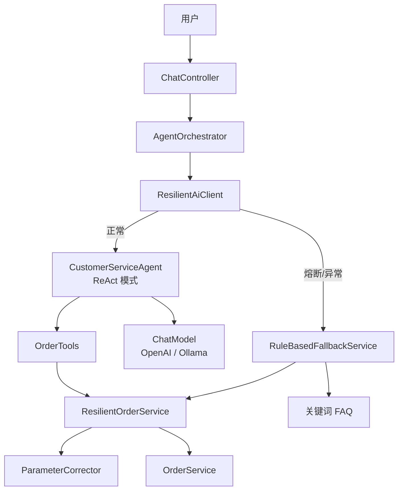

# 智能客服 Agent

> 仓库：[github.com/MMCISAGOODMAN/customer-service-agent](https://github.com/MMCISAGOODMAN/customer-service-agent)

基于 **Spring Boot 3** + **LangChain4j** + **Docker** 的电商智能客服系统。  
核心特性：**ReAct 推理**、**多层自动重试**、**参数修正**、**熔断降级**。

---

## 目录

- [项目简介](#项目简介)
- [架构设计](#架构设计)
- [容错机制](#容错机制)
- [项目结构](#项目结构)
- [快速开始](#快速开始)
- [API 文档](#api-文档)
- [配置说明](#配置说明)
- [测试指南](#测试指南)
- [技术栈](#技术栈)

---

## 项目简介

本项目模拟「智服云」电商平台客服场景。用户通过自然语言查询订单、咨询退换货等问题。系统使用 LangChain4j 构建 **ReAct Agent**，让大模型自主规划步骤、调用工具、根据结果调整策略。

当 AI 服务不可用时，自动降级到**规则引擎**，仍可完成订单查询和 FAQ 回答，保证服务可用性。

### 核心能力一览

| 能力 | 实现方式 | 触发场景 |
|------|----------|----------|
| 订单查询 | LangChain4j `@Tool` | 用户询问订单/物流 |
| ReAct 推理 | AI Services 工具循环 | 每次对话 |
| AI 自动重试 | 工具错误 → Observation → LLM 修正 | 订单号格式错误、查无此单 |
| 参数修正 | `ParameterCorrector` | `ord10001` → `ORD-10001` |
| 订单服务重试 | Spring Retry + 指数退避 | 订单 API 瞬时故障 |
| 熔断保护 | Resilience4j CircuitBreaker | AI 连续失败 |
| 规则降级 | `RuleBasedFallbackService` | 熔断/AI 调用异常 |

---

## 架构设计

### 请求处理流程



### ReAct 循环（AI 层重试）

LangChain4j 的 **AI Services + Tools** 即 ReAct 实现：

```
用户: "查订单 ord10001"
    │
    ▼
Thought  → LLM 分析意图，决定调用 queryOrderById
    │
    ▼
Action   → 执行 OrderTools.queryOrderById("ord10001")
    │
    ▼
Observation → 服务层修正为 ORD-10001，返回订单数据
    │           （或返回错误：「订单不存在」）
    ▼
Thought  → LLM 根据 Observation 决定：回复用户 / 换工具 / 修正参数重试
    │
    ▼
最终回复
```

配置项 `app.agent.max-sequential-tool-invocations` 限制最大推理轮次（默认 10）。

### 三层容错

```
┌─────────────────────────────────────────────────────────┐
│  Layer 1: ReAct 循环（AI 智能重试）                      │
│  工具失败 → 错误文本反馈给 LLM → 修正参数/换策略          │
├─────────────────────────────────────────────────────────┤
│  Layer 2: 基础设施重试                                   │
│  · 订单服务 Spring Retry（瞬时故障，最多 3 次）            │
│  · LLM HTTP max-retries（网络抖动）                       │
├─────────────────────────────────────────────────────────┤
│  Layer 3: 熔断降级                                       │
│  AI 连续失败 → 熔断器 OPEN → 规则引擎查单/FAQ            │
└─────────────────────────────────────────────────────────┘
```

---

## 容错机制

### 1. ReAct AI 自动重试

**代码位置：** `ReactAgentConfig.java`

| 处理器 | 作用 |
|--------|------|
| `maxSequentialToolsInvocations` | 限制 ReAct 最大轮次 |
| `toolArgumentsErrorHandler` | 参数 JSON 错误 → 反馈 LLM 修正 |
| `toolExecutionErrorHandler` | 工具抛异常 → 引导换策略 |
| `hallucinatedToolNameStrategy` | 工具名幻觉 → 提示正确工具名 |

**日志标识：** `[ReAct Action]`、`[ReAct Observation]`

### 2. 参数修正

**代码位置：** `ParameterCorrector.java`、`ResilientOrderService.java`

| 输入 | 修正后 |
|------|--------|
| `ord10001` | `ORD-10001` |
| `10001` | `ORD-10001` |
| `138-0013-8001` | `13800138001` |

### 3. 订单服务重试

**代码位置：** `ResilientOrderService.java`

- Spring `@Retryable`，最多 3 次，指数退避 500ms → 1000ms → 2000ms
- 测试开关：`SIMULATE_ORDER_FAILURE=true`（每 3 次调用模拟 2 次失败）

### 4. 熔断降级

**代码位置：** `ResilientAiClient.java`、`RuleBasedFallbackService.java`

触发条件：
- AI API 调用失败（无效 Key、网络错误等）
- Resilience4j 熔断器 `aiAgent` 状态为 OPEN

降级行为：
- 从用户消息提取订单号/手机号，直接查单
- 关键词匹配 FAQ（退货、配送、发票等）
- 响应 `mode: "rule-based-fallback"`，`fallback: true`

---

## 项目结构

```
customer-service-agent/
├── src/main/java/com/example/customerservice/
│   ├── CustomerServiceApplication.java    # 启动类
│   ├── agent/
│   │   ├── CustomerServiceAgent.java      # ReAct Agent 接口 + System Prompt
│   │   ├── ReactAgentConfig.java          # AiServices.builder 配置
│   │   ├── ResilientAiClient.java         # 熔断包装
│   │   └── AgentOrchestrator.java         # 编排入口
│   ├── config/
│   │   ├── AgentConfig.java               # 对话记忆
│   │   ├── LlmConfig.java                 # ChatModel 选择
│   │   └── GlobalExceptionHandler.java
│   ├── controller/
│   │   └── ChatController.java            # REST API
│   ├── dto/
│   │   ├── ChatRequest.java
│   │   └── ChatResponse.java
│   ├── order/
│   │   ├── OrderService.java              # 内存订单数据
│   │   └── OrderTools.java                # LangChain4j Tools
│   ├── resilience/
│   │   ├── ParameterCorrector.java        # 参数规范化
│   │   └── ResilientOrderService.java     # 订单重试
│   ├── fallback/
│   │   └── RuleBasedFallbackService.java  # 规则降级
│   ├── model/Order.java
│   └── exception/
├── src/main/resources/
│   ├── application.yml                    # 主配置
│   └── application-ollama.yml             # Ollama profile
├── docker-compose.yml
├── Dockerfile
└── pom.xml
```

---

## 快速开始

### 环境要求

- Java 17+
- Maven 3.9+
- Docker（可选）

### 方式一：本地运行（OpenAI / ChatAnywhere）

```bash
git clone <repo>
cd customer-service-agent

export OPENAI_API_KEY=sk-your-key-here

# 若使用 ChatAnywhere，确保 application.yml 中：
#   base-url: https://api.chatanywhere.tech/v1

mvn spring-boot:run
```

### 方式二：Docker + Ollama（无需 API Key）

```bash
docker compose up --build
```

### 方式三：Docker + OpenAI

```bash
export OPENAI_API_KEY=sk-xxx
docker compose --profile openai up customer-service-agent-openai --build
# 访问 http://localhost:8081
```

### 验证

```bash
curl -X POST http://localhost:8080/api/v1/chat \
  -H "Content-Type: application/json" \
  -d '{"message": "帮我查一下订单 ORD-10001"}'
```

---

## API 文档

### POST /api/v1/chat

**请求：**

```json
{
  "message": "查询订单 ORD-10001",
  "sessionId": "可选，不传则自动生成 UUID"
}
```

**成功响应（ReAct 模式）：**

```json
{
  "reply": "您的订单 ORD-10001 已发货...",
  "sessionId": "550e8400-e29b-41d4-a716-446655440000",
  "mode": "react",
  "fallback": false,
  "errorDetail": null,
  "reactRounds": 1,
  "toolCalls": ["queryOrderById({\"orderId\":\"ORD-10001\"})"],
  "timestamp": "2026-05-29T10:00:00Z"
}
```

**降级响应：**

```json
{
  "reply": "[降级模式] 订单 ORD-10001 | 商品: 无线蓝牙耳机 | ...",
  "mode": "rule-based-fallback",
  "fallback": true,
  "errorDetail": "401 Unauthorized",
  "reactRounds": null,
  "toolCalls": null,
  "timestamp": "2026-05-29T10:00:00Z"
}
```

### GET /api/v1/chat

```
GET /api/v1/chat?message=查订单ORD-10001&sessionId=xxx
```

### GET /api/v1/health

服务健康检查。

### Actuator 端点

| 端点 | 说明 |
|------|------|
| `/actuator/health` | 健康状态 |
| `/actuator/circuitbreakers` | 熔断器状态 |
| `/actuator/circuitbreakerevents` | 熔断事件历史 |
| `/actuator/metrics` | 指标 |

---

## 配置说明

### 环境变量

| 变量 | 默认值 | 说明 |
|------|--------|------|
| `OPENAI_API_KEY` | — | OpenAI / ChatAnywhere API Key |
| `OPENAI_MODEL` | `gpt-3.5-turbo` | 模型名称 |
| `LLM_PROVIDER` | `openai` | `openai` 或 `ollama` |
| `OLLAMA_BASE_URL` | `http://localhost:11434` | Ollama 地址 |
| `AGENT_MAX_TOOL_ROUNDS` | `10` | ReAct 最大轮次 |
| `SIMULATE_ORDER_FAILURE` | `false` | 模拟订单服务瞬时故障 |

### application.yml 关键配置

```yaml
langchain4j:
  open-ai:
    chat-model:
      api-key: ${OPENAI_API_KEY}
      model-name: ${OPENAI_MODEL:gpt-3.5-turbo}
      base-url: https://api.chatanywhere.tech/v1   # 第三方代理需加 /v1
      max-retries: 2                                # LLM HTTP 重试

app:
  agent:
    max-sequential-tool-invocations: 10             # ReAct 轮次上限
  order:
    simulate-transient-failure: false               # 测试订单重试
  resilience:
    param-correction-enabled: true
    order-retry:
      max-attempts: 3                               # 订单服务重试次数

resilience4j:
  circuitbreaker:
    instances:
      aiAgent:
        failure-rate-threshold: 50                  # 失败率阈值
        wait-duration-in-open-state: 30s            # 熔断持续时间
```

### LLM 提供商切换

| 场景 | 配置 |
|------|------|
| OpenAI / ChatAnywhere（默认） | 不设置 profile，排除 Ollama AutoConfig |
| Ollama 本地 | `SPRING_PROFILES_ACTIVE=ollama`，排除 OpenAI AutoConfig |

---

## 测试指南

### 快速测试命令

```bash
# 1. 正常 ReAct 查单
curl -X POST http://localhost:8080/api/v1/chat \
  -H "Content-Type: application/json" \
  -d '{"message": "查订单 ORD-10001"}'

# 2. AI 自动重试（错误格式订单号）
curl -X POST http://localhost:8080/api/v1/chat \
  -H "Content-Type: application/json" \
  -d '{"message": "查订单 ord10001"}'

# 3. 订单服务重试（需 SIMULATE_ORDER_FAILURE=true 启动）
curl -X POST http://localhost:8080/api/v1/chat \
  -H "Content-Type: application/json" \
  -d '{"message": "查订单 ORD-10001"}'

# 4. 降级测试（用无效 API Key 启动后执行）
curl -X POST http://localhost:8080/api/v1/chat \
  -H "Content-Type: application/json" \
  -d '{"message": "查订单 ORD-10001"}'
# 期望: fallback=true, mode=rule-based-fallback

# 5. 查看熔断器
curl http://localhost:8080/actuator/circuitbreakers
```

### 单元测试

```bash
mvn test
```

---

## 技术栈

| 组件 | 版本 | 用途 |
|------|------|------|
| Java | 17 | 运行时 |
| Spring Boot | 3.4.2 | Web 框架 |
| LangChain4j | 1.15.1-beta25 | AI Services、Tools、ReAct |
| Spring Retry | — | 订单服务重试 |
| Resilience4j | 2.2.0 | 熔断器 |
| Docker | — | 容器化部署 |

---

## 内置测试数据

| 订单号 | 手机号 | 客户 | 商品 | 状态 |
|--------|--------|------|------|------|
| ORD-10001 | 13800138001 | 张三 | 无线蓝牙耳机 | 已发货 |
| ORD-10002 | 13900139002 | 李四 | 智能手表 | 已签收 |
| ORD-10003 | 13700137003 | 王五 | 机械键盘 | 已付款 |

---

## License

MIT
